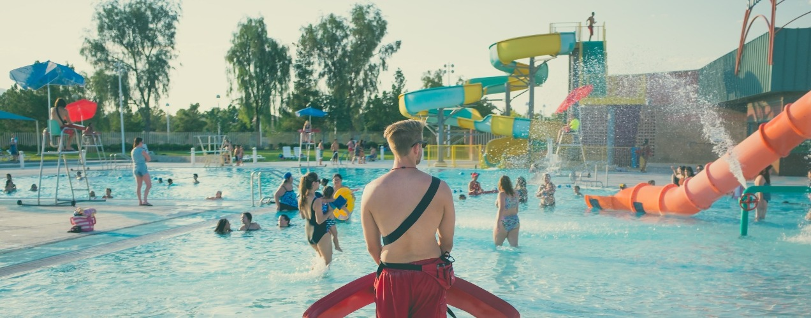

# Waterpark

## Quick Start

1. install Node v15, Docker, Docker Compose
1. clone this repository
1. run `npm install`
1. run `docker-compose up` to start server and db
1. `cd` into `client`
1. run `npm install`
1. run `npm run dev` to start client

## Documentation

- [Client README.md](client/README.md)
- [Server README.md](server/README.md)
- [Server ARCHITECTURE.md](server/ARCHITECTURE.md)
