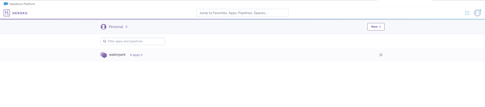
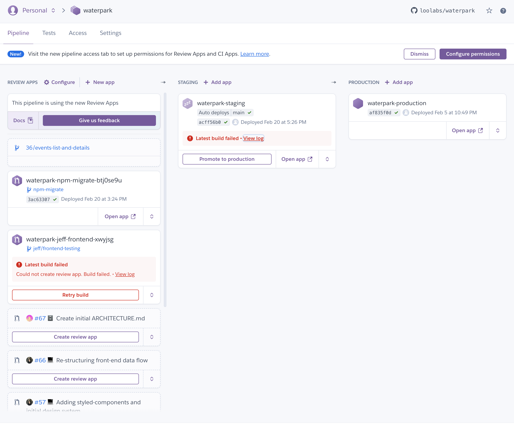
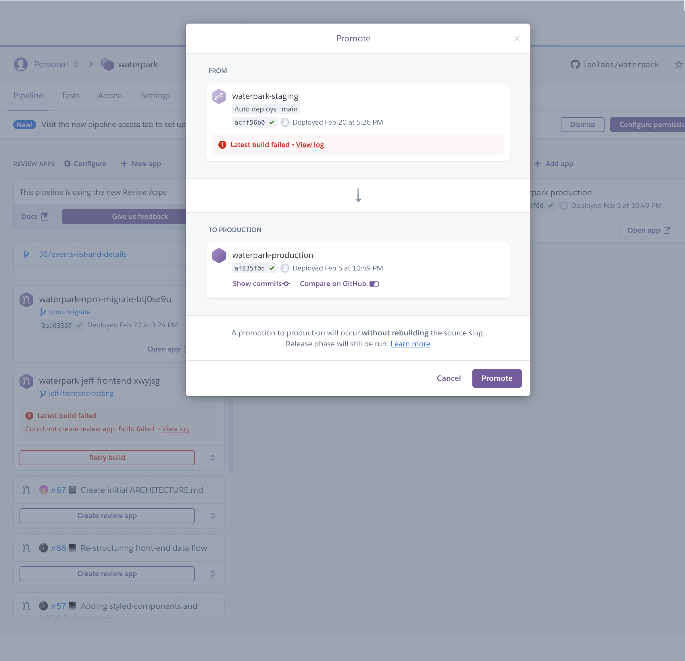

# Waterpark Server

Waterpark's backend API server

## Getting Started

These instructions will get you a copy of the project up and running on your local machine for development and testing purposes. See deployment for notes on how to deploy the project on a live system.

### Prerequisites

1. [Docker](https://www.docker.com/products/docker-desktop)
1. `.env` in the root directory of the monorepo

```
SERVER_PORT=3001
DB_DATABASE_NAME=clubs
DB_USERNAME=waterpark
DB_PASSWORD=waterpark
DB_PORT=5432
DATABASE_URL=postgresql://waterpark:waterpark@db/clubs
```

### Installing

1. Clone the `waterpark` repository.
1. In the root directory of `waterpark`, run `docker-compose up` to start the express and postgres servers.

You should see messages in your terminal from the `server` and `postgres` containers, and finally be greeted with:


## Tests

We separate our tests into two categories. To run integration tests locally, you must have the entire server running in the background (for now). This might change in the future.

Unit tests: `npm run test:unit`

Integration tests: `npm run test:integration`

## Migrations

Here is how to make a [migration](https://en.wikipedia.org/wiki/Schema_migration) to our database schemas.

1. Make the change to the MikroORM entity of choice. Entities are located in `src/shared/infra/db/entities`.
1. Run `docker container ls`. Find the container id for the server container.
1. Run `docker exec -it <CONTAINER_ID> sh`.
1. Run `npm run migration:create`.
1. A migration file should now be created in `src/migrations`.

## Deployment

(For Loo Lab members with access to Heroku).

1. Login to the Heroku dashboard.
1. Click the waterpark pipeline.
   
1. You should see three environments. Review apps, staging, and production. Review apps are automatically created for each PR. Staging is `main`. Any commits merged into `main` will automatically be released to the staging environment. Production is the live environment used for production.
   
1. To promote the staging environment to production, simply click the "promote to production" button. You'll be prompted with a modal:
   
1. Click promote

The latest commit (and all the previous commits) in the staging environment will then be promoted to production!

## Built With

- [Typescript](https://www.typescriptlang.org/) - Language
- [Express](https://expressjs.com/) - HTTP Server
- [MikroORM](https://mikro-orm.io/) - ORM
- [Postgres](https://www.postgresql.org/) - Database

## Contributing

Please read [CONTRIBUTING.md](https://gist.github.com/PurpleBooth/b24679402957c63ec426) for details on our code of conduct, and the process for submitting pull requests.

## License

This project is licensed under the ISC License - see the [LICENSE.md](../LICENSE.md) file for details
